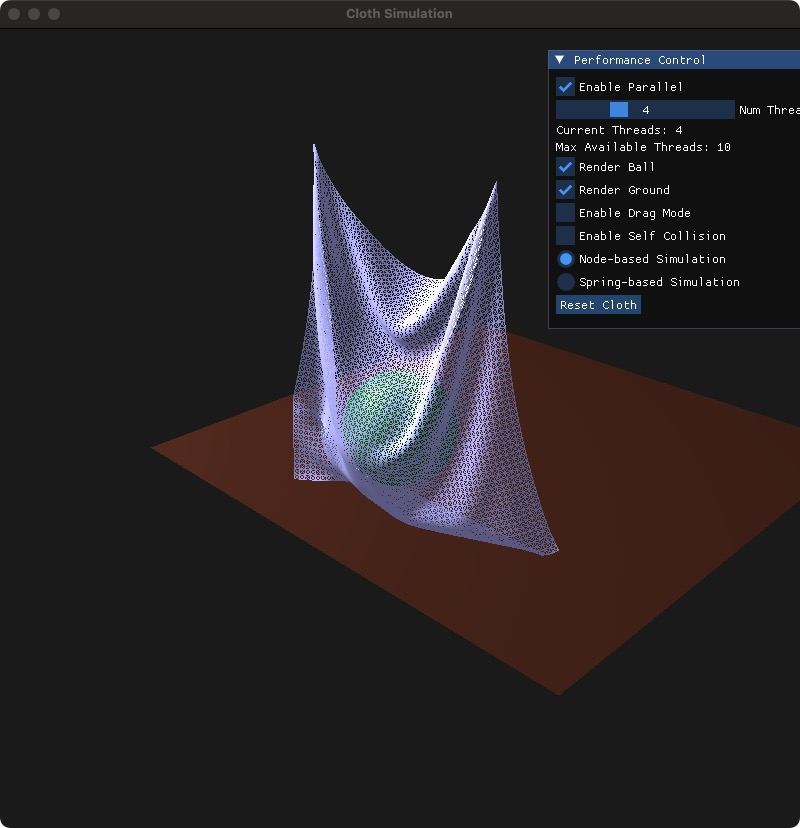
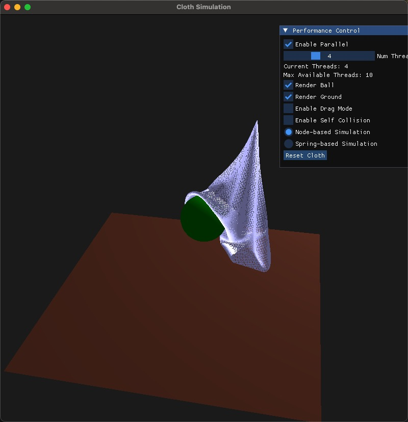

# Final Project: CS 151 Parallel Optimization In Cloth Simulation
### UI

  

- ##### Parallel option
  - use slider to control the number of threads
- ##### Simulation Control
  - two modes:
    - `Pull Model`
    - `Push Model`
# Final Project: Cloth Simulation
### UI
- ##### Program Control
  - `ESC` Exit
  - `T` Pause the simulation
  - `R` Resume the simulation
- ##### Camera
  - Using mouse to control the camera
  - `MOUSE_BUTTON_LEFT` Click to Pan target point
  - `MOUSE_BUTTON_RIGHT` Click to Orbit rotation
  - `SCROLL_UP` Zoom in
  - `SCROLL_DOWN` Zoom out
- ##### External Force
  - `↑` `↓` `←` `→` Apply wind force
  - `O` Drop left pin
  - `P` Drop right pin
- ##### Rendering Draw Mode:
  - `Z` Node Mode
  - `X` Spring Mode
  - `C` Cloth Mode
### Environment
- ##### OpenGL 3.3
  - GLAD
  - glfw
- ##### ImGui
- ##### OpenMP
- ##### C++

### Run the program
- ##### Run the program
  - `make`
  - `./ClothSimulation`

### Code skeleton from https://github.com/xxMeow/ClothSimulation
### Thanks to xxMeow for the great work!